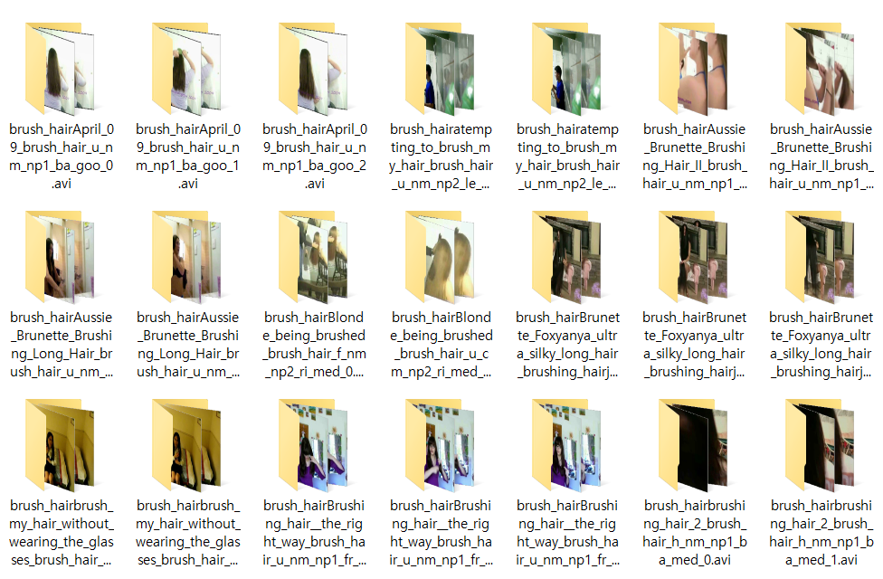

Simple frame extractor for video dataset
=======================================

[notice]
--------------
-2020.09.22

added dependency

fps option added.

use argument like this

    python main.py --fps 30

My Dataset is 2.33Tb. Using OpenCV is too slow. 
So I use ffmpeg instead. 

- for windows

    download ffmpeg build for windows
    https://www.gyan.dev/ffmpeg/builds/packages/
    and add binary exe file's directory to windows environment variable path 

- for linux

    sudo apt-get install ffmpeg

-2020.09.19

This is simple frame extractor 

I use it for our lab's dataset but this is not public yet.

So I tested on one of the famouse and light benchmark dataset for human action recognition (HMDB-51 dataset). 

https://serre-lab.clps.brown.edu/resource/hmdb-a-large-human-motion-database/#Downloads

And it worked well.

FPS option will be added soon

[how to use]
---------------

If you follow the details below, the extractor will work on any dataset.

input format :

    The dataset must be in one folder.

output foramt : 

    output folder will be generated like this.
    destination_dir/video_name/frame000001.jpg 
    
    if you want to change this format please modify line below
    
    if not(os.path.isdir(dst+"\\"+label+"_"+name)):
        os.makedirs(os.path.join(dst+"\\"+label+"_"+name))
        os.system("ffmpeg -i "+vid+" "+"-r "+str(fps)+" "+ "-start_number 0 "+dst+"\\"+label+"_"+name+"\\frame%6d.jpg")

    

